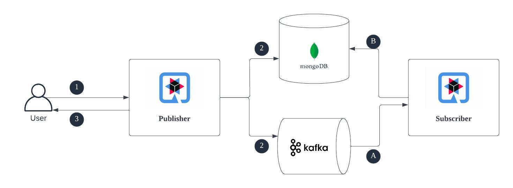

# Reactive Java Quarkus Demo - [MongoDB + Kafka]

Reactive serverless applications to persist data into a mongoDB database and at the same time publish an event to a 
Apache Kafka cluster. This project includes two microservices which are intended to deploy as serverless workloads.

### Workflow scenario:
1. Create a bank account (persist data into mongoDB database)
2. Request for account activation (send Account object into a Kafka topic for approval process)
3. Account approval trigger asynchronously (from the subscriber microservice)

## Overview



## How to run

- Spin up a Kafka cluster(for local setup -> [use RedPanda](https://docs.redpanda.com/docs/21.11/quickstart/quick-start-macos/))
- Spin up a mongodb container
- Modify the application.properties file in both projects
- Start the publisher and subscriber using `./mvnw compile quarkus:dev`

### Create an Account

```
curl --location 'http://localhost:8080/account' \
--header 'Content-Type: application/json' \
--data '{
    "accountHolderName": "Andrew",
    "accountNumber": "DEw9345357224234",
    "balance": 2546754,
    "accountType": "Savings",
    "bankName": "N46"
}'
```

### Get all accounts
```
curl --location 'http://localhost:8080/account'
```

### Approve an account
```
curl --location --request PUT 'http://localhost:8080/account/activate' \
--header 'Content-Type: application/json' \
--data '{
    "id": "647f93e54b1c08212aad28c1",
    "accountHolderName": "Andrew",
    "accountNumber": "DEw9345357224234",
    "accountType": "Savings",
    "balance": 2546754.0,
    "bankName": "N46",
    "createdAt": "2023-06-06T22:15:33.794957",
    "isActive": false,
    "status": "INACTIVE"
}'
```